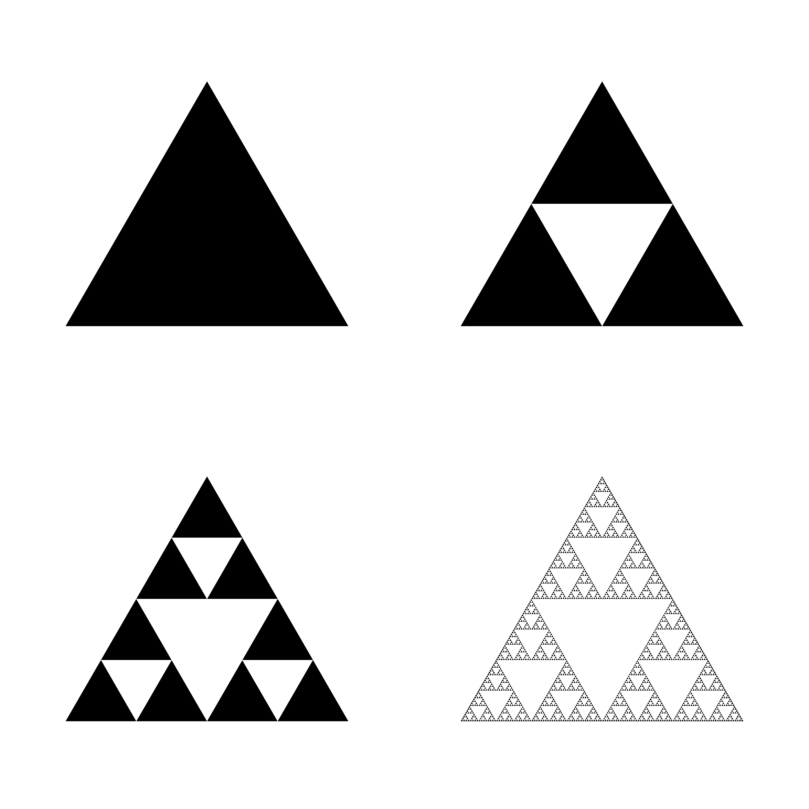

# FractalsFun

Some Python code for generating some interesting fractal images.

Generate images of fractals of type:
 - [Sierpiński Gasket](https://en.wikipedia.org/wiki/Sierpi%C5%84ski_triangle) (a.k.a Sierpiński Triangles)
 - [Bedford-McMullen Carpet](https://demonstrations.wolfram.com/BedfordMcMullenCarpets/)
 - 'Rotating Squares'

---

### Example usage:

To generate an array of Sierpiński triangles.
```
python fractals.py --fractal 'triangles' --max_iters '[[0,1],[2,3]]'
```



To generate a single Bedford-McMullen carpet and display on screen.
```
python fractals.py --fractal 'carpet' --max_iters '[[5]]' --remove '[3]' -s
```


---

### Further reading:

Introductory:
- [Fractal Geometry: Mathematical Foundations and Applications](https://onlinelibrary.wiley.com/doi/book/10.1002/0470013850) considered *the* book on Fractal Geometry and the freely available opening chapter gives a great introduction to fractals.
- The [Fractal Foundation](https://fractalfoundation.org/resources/what-are-fractals/#:~:text=Fractals%20are%20infinitely%20complex%20patterns,systems%20%E2%80%93%20the%20pictures%20of%20Chaos.) is a website dedicated to all things fractals.

Advanced:
- The Bedford-McMullen carpet was discovered by two researchers independently in the PhD thesis [Crinkly curves, Markov partitions and dimension](https://wrap.warwick.ac.uk/50539/) and the paper [The Hausdorff dimension of general Sierpiński carpets](https://projecteuclid.org/journals/nagoya-mathematical-journal/volume-96/issue-none/The-Hausdorff-dimension-of-general-Sierpi%C5%84ski-carpets/nmj/1118787639.full).
- The seminal paper [Local entropy averages and projections of fractal measures](https://annals.math.princeton.edu/wp-content/uploads/annals-v175-n3-p01-s.pdf) presents results on self-simliar sets with dense rotations.